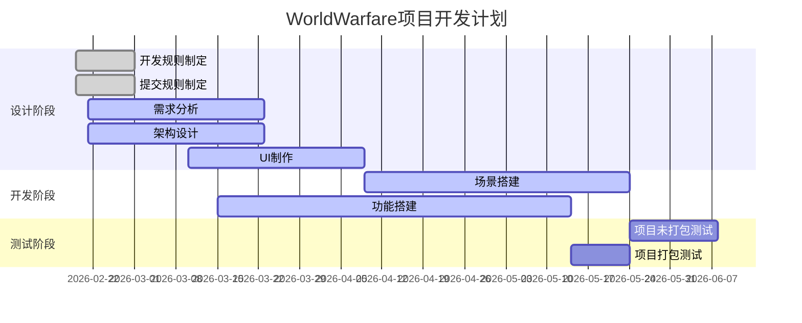

# WorldWarfare
世界战争塔防类型游戏

# 开发准则
## (一)提交规则
### 图标优先原则
主题简洁明了，以某种宏观表现，使用双引号突出为主。
比如我做了ai，那么图标+ai
```
例如:✅“完成ai”
```
---

描述原则
需要详细描述修改和新增的文件。
比如修改了一个蓝图类为bp_actor，和新增资产lll。
示例如下(细节描述可以用小括号扩展，不做硬性要求):

```
⚠️
1.修改bp_actor(可介绍可不介绍)

🍀
1.新增III(可介绍可不介绍)
```
---

### 图标含义

~~~
✅(主题专属:完成，测试过没有任何问题和bug)

⚠️(主题:描述功能已经测试但有bug，需修改，详细介绍:修改的文件)

❌(主题:新增功能但未测试，细节介绍:废弃资产)

🍀(主题:一次大的版本发布，并且已经测试并完成通过，细节介绍:新增资产)

🚧(主题:需要优化的问题，细节介绍:待优化的功能)

🛠️(主题:在原有的功能上进行扩展而非修改，注意冲突合并，细节介绍:已经优化的问题)

~~~
---
## (二)命名规则
#### 按照 C++ 命名规则(魔改一下,unreal资产类参考"_")

|      命名风格      |      适用场景      |      示例      |
| :------: | :--------: | :---------------------: |
| 大驼峰（PascalCase） | 类名 | class `"NetworkManager"` |
|  | 结构体名 |  `Struct_Data` |
|  | 枚举类型名 | `Enum_Start` |
| 小驼峰（camelCase） | 变量名 | `maxValue` |
|  |  函数名 | `void processData` 若有返回值则 `返回类型 processData` |
| 全大写+下划线 | 宏定义（#define）| `Define MAX_BUFFER_SIZE` |
|  |  枚举值 | 大写 `RED, GREEN, BLUE` |
| 加前缀 m_ | 局部变量 | `m_countValue` |
| 加前缀 g_ | 全局变量 | ` g_appVersion` |
| 加后缀 _ptr | 指针，对象引用 | `类型 *p_ptr;` or `对象名_ptr`
| 接口_命名 | 给接口命名 | `Interface_名称` |

---

# 开发流程

## 开发规划

---

## 开发循环
---


