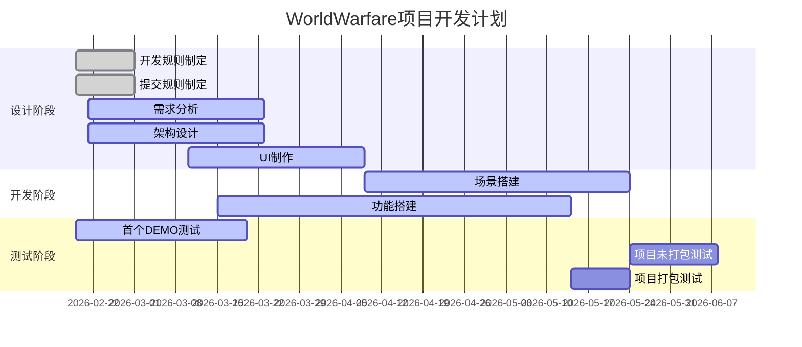

# WorldWarfare
世界战争塔防类型游戏

# 开发准则
## (一)提交规则
### 图标优先原则
主题简洁明了，以某种宏观表现，使用双引号突出为主。
比如我做了ai，那么图标+ai
```
例如:✅“完成ai”
```
---

描述原则
需要详细描述修改和新增的文件。
比如修改了一个蓝图类为bp_actor，和新增资产lll。
示例如下(细节描述可以用小括号扩展，不做硬性要求):

```
⚠️
1.修改bp_actor(可介绍可不介绍)

🍀
1.新增III(可介绍可不介绍)
```
---

### 图标含义

~~~
✅(主题专属:完成，测试过没有任何问题和bug)

⚠️(主题:描述功能已经测试但有bug，需修改，详细介绍:修改的文件)

❌(主题:新增功能但未测试，细节介绍:废弃资产)

🍀(主题:一次大的版本发布，并且已经测试并完成通过，细节介绍:新增资产)

🚧(主题:需要优化的问题，细节介绍:待优化的功能)

🛠️(主题:在原有的功能上进行扩展而非修改，注意冲突合并，细节介绍:已经优化的问题)

~~~
---
## (二)命名规则
#### 按照 C++ 命名规则(魔改一下,unreal资产类参考"_")

|      命名风格      |      适用场景      |      示例      |
| :------: | :--------: | :---------------------: |
| 大驼峰（PascalCase） | 类名 | class `"NetworkManager"` |
|  | 结构体名 |  `Struct_Data` |
|  | 枚举类型名 | `Enum_Start` |
| 小驼峰（camelCase） | 变量名 | `maxValue` |
|  |  函数名 | `void processData` 若有返回值则 `返回类型 processData` |
| 全大写+下划线 | 宏定义（#define）| `Define MAX_BUFFER_SIZE` |
|  |  枚举值 | 大写 `RED, GREEN, BLUE` |
| 加前缀 m_ | 局部变量 | `m_countValue` |
| 加前缀 g_ | 全局变量 | ` g_appVersion` |
| 加后缀 _ptr | 指针，对象引用 | `类型 *p_ptr;` or `对象名_ptr`
| 接口_命名 | 给接口命名 | `Interface_名称` |

---

# 开发流程

## 开发规划

```mermaid
gantt
    title WorldWarfare项目开发计划
    dateFormat  YYYY-MM-DD
    section 设计阶段
    开发规则制定 : done, des1, 2026-02-19, 10d
    提交规则制定 : done, des1, 2026-02-19, 10d
    需求分析   :active,    des1, 2026-02-21, 30d
    架构设计   :active,    des3, 2026-2-21, 30d
    UI制作   :active,    des2, 2026-03-10, 30d
    section 开发阶段
    场景搭建:active, dev1, after des2, 45d
    功能搭建:active, dev2, 2026-03-15, 60d
    section 测试阶段
    首个DEMO测试:active,est3, 2026-02-19, 2026-03-20
    项目未打包测试:test1, after dev1, 15d
    项目打包测试:test2, after dev2, 10d
```
---

## 开发循环
---


## Issues详细规划

### 实施顺序

#### 第一阶段：地基能力
1. Issue #32 乡村地图
2. Issue #33 敌人：丧尸
3. Issue #36 建造系统

#### 第二阶段：系统闭环
4. Issue #37 建造时间
5. Issue #38 资源补给系统
6. Issue #39 防御塔

#### 第三阶段：高风险验证
7. Issue #35 建筑破坏
8. Issue #34 体素：田地可破坏

#### 排期原则
- 先有可战斗地图和敌人，再验证建造玩法。
- 先形成建造闭环，再讨论时间、资源和塔的数值平衡。
- 建筑破坏与地形破坏依赖寻路和性能验证，统一放在后期评估。

### Issue #32 乡村地图
- 目标：产出可用于玩法验证的主地图原型，而不是只做静态场景。
- 范围：
  - 明确46×46地图单位尺度、可行走区、阻挡区、出生点、核心基地位置。
  - 固定工厂点位、民房点位、主要道路和尸群进攻通道。
  - 预留建筑放置区、防御塔射界区、可破坏地形区。
  - 补齐地图交互规则：可建造、不可建造、可破坏、不可破坏区域。
- 前置依赖：
  - 当前默认地图 `/Game/Level/Test1.Test1` 作为原型验证入口。
- 核心验证点：
  - 出生点到基地至少存在一条稳定可寻路路径。
  - 地图分区是否能支撑建造、战斗和破坏验证。
- 交付物：
  - 一张可运行的乡村原型地图。
  - 工厂、民房、基地点位标记。
  - 进攻通道与建筑预留区说明。
- 验收标准：
  - 角色可进入地图完成一轮路径测试。
  - 点位可视化明确。
  - 主要道路和阻挡规则可复用到后续系统。
- 风险与协作：
  - 风险：地图过于偏静态展示，无法支撑玩法验证。
  - 协作：需要和场景搭建同学统一点位与道路规范。

### Issue #33 敌人：丧尸
- 目标：完成尸群基础行为闭环验证。
- 范围：
  - 拆分为单体丧尸、群集丧尸、波次刷新三层验证。
  - 单体层验证移动、索敌、攻击基地或建筑、死亡反馈。
  - 群集层验证MassAI或替代方案对密度需求的支撑情况。
  - 寻路层验证主路径推进、绕障和被阻挡后的重规划。
  - 特殊敌人后置，当前只验证普通丧尸。
- 前置依赖：
  - 依赖乡村地图完成基础通道和出生点布局。
- 核心验证点：
  - 单波尸群能否稳定推进到基地。
  - 遇到建筑阻挡后能否基础绕行或重规划。
  - 大规模刷新时帧率是否可接受。
- 交付物：
  - 丧尸原型敌人。
  - 一版波次刷新配置。
  - 一组寻路与绕障测试记录。
- 验收标准：
  - 尸群可稳定从出生点推进到基地。
  - 遇阻挡时能产生合理路径反应。
  - 性能测试结果可作为后续功能基线。
- 风险与协作：
  - 风险：群集规模扩大后性能和路径稳定性下降。
  - 协作：需要与AI/寻路方向同学同步实现方案。

### Issue #36 建造系统
- 目标：建立可落地的放置规则，而不是只做“能摆出来”。
- 范围：
  - 定义建造流程：选择建筑、预览、合法性检测、确认放置、扣资源。
  - 明确判定规则：地面坡度、碰撞重叠、压路检测、越界检测。
  - 区分可阻挡放置与不可阻挡放置两类建筑。
  - 预留建筑升级、拆除、修复接口。
  - 明确红绿预览和失败原因提示。
- 前置依赖：
  - 依赖乡村地图提供可建造区和阻挡区。
  - 依赖敌人路径测试结果确定压路规则。
- 核心验证点：
  - 一类建筑能否完成完整放置流程。
  - 非法区域能否稳定拦截并提示原因。
  - 放置后能否接入寻路和战斗逻辑。
- 交付物：
  - 最小可用放置流程。
  - 一套放置合法性规则。
  - 建造反馈原型。
- 验收标准：
  - 玩家可完成一次完整建造。
  - 非法放置无法通过。
  - 建筑参与后续路径和战斗验证。
- 风险与协作：
  - 风险：放置系统和寻路系统规则冲突。
  - 协作：需要与地图和AI实现同步验证。

### Issue #37 建造时间
- 目标：把建造等待纳入节奏系统，而不是仅做数值表。
- 范围：
  - 定义墙体、机枪塔、导弹塔、工厂等建筑的建造时长分层。
  - 对齐尸群波次节奏，避免过度压制或缺乏压力。
  - 明确建造中状态：是否可取消、是否可被攻击、是否作为半成品阻挡。
  - 评估是否开放加速建造或瞬建机制。
- 前置依赖：
  - 依赖建造系统完成基础放置流程。
  - 依赖敌人波次参数形成节奏基线。
- 核心验证点：
  - 建造完成时间与波次到达时间是否匹配。
  - 半成品状态是否影响防守决策。
- 交付物：
  - 一版建筑建造时间表。
  - 一组“建造—尸群到达—投入使用”节奏测试记录。
- 验收标准：
  - 至少完成一版可运行时间参数。
  - 节奏测试可重复复用。
  - 时间表能支撑后续平衡迭代。
- 风险与协作：
  - 风险：建造时间与波次节奏耦合过深，难以调整。
  - 协作：需要与波次设计和防御塔数值统一节奏。

### Issue #38 资源补给系统
- 目标：形成驱动建造与防守决策的基础经济闭环。
- 范围：
  - 先定义最小资源集合，避免初期资源类型膨胀。
  - 区分工厂产出与每日/每波补给节奏。
  - 资源来源包括：初始资源、时间补给、工厂产出、击杀奖励、事件奖励。
  - 资源去向包括：建造、升级、修复、特殊技能。
  - 优先形成最小闭环，再决定是否扩展多资源体系。
- 前置依赖：
  - 依赖建造系统确定资源扣除入口。
  - 依赖建造时间和波次节奏确定资源发放速度。
- 核心验证点：
  - 玩家是否可通过至少两种方式稳定获得资源。
  - 资源节奏是否会导致停滞或通货膨胀。
- 交付物：
  - 一版经济循环设计。
  - 资源获取与消耗表。
  - 工厂与补给逻辑说明。
- 验收标准：
  - 建造和维护都依赖资源。
  - 资源获取路径清晰。
  - 经济循环可驱动持续防守决策。
- 风险与协作：
  - 风险：资源节奏失衡导致玩法失去决策压力。
  - 协作：需要和建造、塔防数值同步迭代。

### Issue #39 防御塔
- 目标：先建立塔的职责差异，再进行数值平衡。
- 范围：
  - 机枪塔定位为低成本、持续输出、对单或中小群体。
  - 导弹塔定位为高成本、爆发或范围伤害、克制密集群。
  - 城墙定位为阻挡、拖延、引导路径，不承担主要输出。
  - 为每类建筑定义生命、防御、攻击、射程、攻速、消耗、建造时间。
  - 明确是否支持升级、维修以及是否会被丧尸优先攻击。
- 前置依赖：
  - 依赖资源系统和建造时间系统形成完整约束。
  - 依赖敌人原型提供稳定测试对象。
- 核心验证点：
  - 三类建筑职责是否明显分化。
  - 同一波测试中是否能产生战术差异。
- 交付物：
  - 三类核心防御建筑定位说明。
  - 一版塔防基础数值表。
  - 一组对比测试结论。
- 验收标准：
  - 三类建筑职责不重叠。
  - 战斗表现具有清晰差异。
  - 数值表可直接进入平衡迭代。
- 风险与协作：
  - 风险：塔职责不清导致玩法同质化。
  - 协作：需要与敌人和资源节奏共同验证。

### Issue #35 建筑破坏
- 目标：让建筑破坏与寻路变化形成稳定系统，而不是只播放破坏效果。
- 范围：
  - 定义建筑受击、损坏、摧毁、残骸四个状态是否存在。
  - 验证建筑被毁后路径是否立即重算、重算范围多大、性能代价多高。
  - 明确残骸是否阻挡、是否可清理、是否影响再次建造。
  - 重点验证城墙被毁后的路径切换是否自然。
- 前置依赖：
  - 依赖建造系统、敌人系统和塔防建筑基础原型。
- 核心验证点：
  - 建筑破坏后AI路径能否稳定更新。
  - 大量建筑被毁时性能是否可接受。
  - 破坏反馈、阻挡变化和玩法影响是否一致。
- 交付物：
  - 建筑破坏状态定义。
  - 一组路径更新验证记录。
  - 残骸处理规则。
- 验收标准：
  - 建筑破坏后路径稳定更新。
  - 批量破坏场景无明显卡顿。
  - 破坏结果可反向影响建造与防守。
- 风险与协作：
  - 风险：路径频繁重算带来性能抖动。
  - 协作：需要和AI、建造、防御塔模块联调。

### Issue #34 体素：田地可破坏
- 目标：验证地形可破坏是否适合当前项目，而不是直接全面铺开。
- 范围：
  - 限定在田地区域做局部可破坏原型。
  - 明确破坏形式：挖坑、削平、局部塌陷或仅体素消失。
  - 评估破坏后对寻路、碰撞、同步和性能的影响。
  - 明确是否允许玩家利用地形破坏改变尸群路径。
  - 输出“能做 / 不能做 / 代价过高”的技术结论。
- 前置依赖：
  - 依赖地图上已经存在可区分的田地区域。
  - 依赖建筑破坏和敌人寻路验证结果作为参考基线。
- 核心验证点：
  - 局部破坏是否能稳定演示。
  - 地形变化对路径和碰撞影响是否可控。
  - 性能与开发复杂度是否在项目可承受范围内。
- 交付物：
  - 一组局部地形破坏演示。
  - 一份性能结论与限制条件。
  - 一份是否进入正式玩法范围的建议。
- 验收标准：
  - 至少完成一组田地区域破坏验证。
  - 有明确性能结论和限制说明。
  - 有清晰的继续投入或暂缓决策。
- 风险与协作：
  - 风险：体素方案开发成本和性能成本过高。
  - 协作：需要与地图、AI、性能验证同学共同评估。

### 统一Issue模板
- 目标
- 范围
- 前置依赖
- 核心验证点
- 交付物
- 验收标准
- 风险与待协作人员

## 关于许可证授权
```
Apache 许可证

版本2.0,2004年1月
http://www.apache.org/licenses/BOOT-2.0

使用、复制和分发的条款与条件

1. 定义。
“许可”指本文件第1至9节定义的使用、复制和分发的条款和条件。
“许可方”指版权所有者或由版权所有者授权的实体，授予许可。
“法人实体”指代理实体及其所有关联方的联合。
“您”（或“您的”）指行使本许可证授予许可的个人或法人实体。
“源代码”形式应指用于修改的首选形式，包括但不限于软件源代码、文档源代码和配置文件。
“对象”形式指源代码的机械变换或转换产生的任何形式，包括但不限于编译的目标代码、生成文档以及转换到其他媒介类型。
“作品”指作者身份的作品，无论是作为独立产品还是作为更大作品的一部分，均由随本许可协议附带的版权声明所标示。
“衍生作品”指任何基于（或源自）作品的作品，无论是源头还是对象形式，且其编辑修订、注释、阐述或其他修改整体上代表原创作者身份的作品。
“贡献”指提交给许可方以纳入作品的任何作者作品。
“贡献者”指许可方及其代表的任何个人或法人实体，其代表被许可方接收并随后纳入作品。

2. 版权许可授予。
根据本许可证的条款和条件，每位贡献者特此授予您一项永久、全球性、非独占性、免版税的版权许可，用于使用、复制、制作衍生作品、公开展示、公开表演、再许可和分发该作品及其衍生作品的源或对象形式。

3. 专利许可授予。
在遵守本许可条款和条件的前提下，每位贡献者特此授予您一项永久、全球性、非独占性、免版税的专利许可，用于制作、使用、销售、提供销售、进口及以其他方式转让作品。

4. 重新分配。
您可以以任何媒介复制和分发作品或衍生作品的副本，无论有无修改，只要满足以下条件：
（1） 您必须向任何其他作品或衍生作品的接收者提供本许可副本;以及
（2）您必须使任何修改的文件都带有显著的通知，说明您已更改文件;以及
（3） 您必须以任何衍生作品的原始形式保留本许可协议的副本;以及
（4）您必须包含显著的声明，说明该作品源自许可方的作品。

5. 提交贡献。
除非您明确说明，否则您有意提交的任何贡献均应遵守本许可条款和条件。

6. 商标。
本许可证不授予使用许可方的商号、商标、服务标志或产品名称，除非为描述性用途且许可方提供的商标规则允许。

7. 免责声明。
除非适用法律要求或书面约定，许可方以“现状”方式提供作品（以及每位贡献者均提供其贡献），不作任何明示或暗示的保证或条件，包括但不限于任何关于产权、不侵权、可销性或特定用途适用性的保证或条件。

8. 责任限制。
无论如何，无论法律理论如何，无论是侵权行为（包括过失）、合同或其他方式，除非适用法律（如故意和严重过失行为）或书面约定，任何贡献者都不会对您承担损害赔偿责任，包括因本许可或因使用或无法使用本作品而产生的任何直接、间接、特殊、附带或后果性质的损害（包括但不包括）赔偿限于商誉损失、停工、计算机故障或故障，或任何其他商业损害或损失）。

9. 接受许可。
如果您复制、修改或分发作品或其任何衍生作品，即表示您同意该许可。

10. 遵守适用法律。
您在行使本许可证下的权利时，应遵守所有适用的法律、法规和外国出口法律。

分支特定许可条款：

- "main"仅允许修改、分发和私人使用（禁止商业用途，保护其他开发者的知识产权）。
- "Develop"授予商业许可权。
```
| 分支许可授权 | 是否允许商业目的 | 是否允许被修改 | 是否允许被分发 | 私人使用 |
| :---: | :---: | :---: | :---: | :---: | 
| main | ❌ | ✅ | ✅ | ✅ |
| Develop | ✅ | ✅ | ✅ | ✅ |
