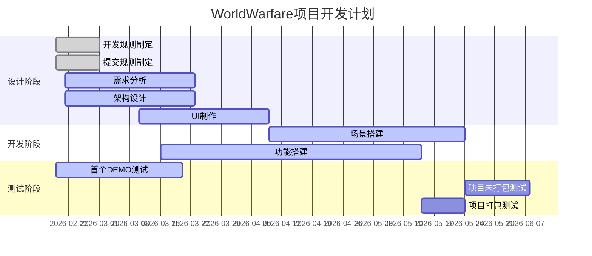

# WorldWarfare
世界战争塔防类型游戏

# 开发准则
## (一)提交规则
### 图标优先原则
主题简洁明了，以某种宏观表现，使用双引号突出为主。
比如我做了ai，那么图标+ai
```
例如:✅“完成ai”
```
---

描述原则
需要详细描述修改和新增的文件。
比如修改了一个蓝图类为bp_actor，和新增资产lll。
示例如下(细节描述可以用小括号扩展，不做硬性要求):

```
⚠️
1.修改bp_actor(可介绍可不介绍)

🍀
1.新增III(可介绍可不介绍)
```
---

### 图标含义

~~~
✅(主题专属:完成，测试过没有任何问题和bug)

⚠️(主题:描述功能已经测试但有bug，需修改，详细介绍:修改的文件)

❌(主题:新增功能但未测试，细节介绍:废弃资产)

🍀(主题:一次大的版本发布，并且已经测试并完成通过，细节介绍:新增资产)

🚧(主题:需要优化的问题，细节介绍:待优化的功能)

🛠️(主题:在原有的功能上进行扩展而非修改，注意冲突合并，细节介绍:已经优化的问题)

~~~
---
## (二)命名规则
#### 按照 C++ 命名规则(魔改一下,unreal资产类参考"_")

|      命名风格      |      适用场景      |      示例      |
| :------: | :--------: | :---------------------: |
| 大驼峰（PascalCase） | 类名 | class `"NetworkManager"` |
|  | 结构体名 |  `Struct_Data` |
|  | 枚举类型名 | `Enum_Start` |
| 小驼峰（camelCase） | 变量名 | `maxValue` |
|  |  函数名 | `void processData` 若有返回值则 `返回类型 processData` |
| 全大写+下划线 | 宏定义（#define）| `Define MAX_BUFFER_SIZE` |
|  |  枚举值 | 大写 `RED, GREEN, BLUE` |
| 加前缀 m_ | 局部变量 | `m_countValue` |
| 加前缀 g_ | 全局变量 | ` g_appVersion` |
| 加后缀 _ptr | 指针，对象引用 | `类型 *p_ptr;` or `对象名_ptr`
| 接口_命名 | 给接口命名 | `Interface_名称` |

---

# 开发流程

## 开发规划

```mermaid
gantt
    title WorldWarfare项目开发计划
    dateFormat  YYYY-MM-DD
    section 设计阶段
    开发规则制定 : done, des1, 2026-02-19, 10d
    提交规则制定 : done, des1, 2026-02-19, 10d
    需求分析   :active,    des1, 2026-02-21, 30d
    架构设计   :active,    des3, 2026-2-21, 30d
    UI制作   :active,    des2, 2026-03-10, 30d
    section 开发阶段
    场景搭建:active, dev1, after des2, 45d
    功能搭建:active, dev2, 2026-03-15, 60d
    section 测试阶段
    首个DEMO测试:active,est3, 2026-02-19, 2026-03-20
    项目未打包测试:test1, after dev1, 15d
    项目打包测试:test2, after dev2, 10d
```
---

## 开发循环
---


## 关于许可证授权
```
Apache 许可证

版本2.0,2004年1月
http://www.apache.org/licenses/BOOT-2.0

使用、复制和分发的条款与条件

1. 定义。
“许可”指本文件第1至9节定义的使用、复制和分发的条款和条件。
“许可方”指版权所有者或由版权所有者授权的实体，授予许可。
“法人实体”指代理实体及其所有关联方的联合。
“您”（或“您的”）指行使本许可证授予许可的个人或法人实体。
“源代码”形式应指用于修改的首选形式，包括但不限于软件源代码、文档源代码和配置文件。
“对象”形式指源代码的机械变换或转换产生的任何形式，包括但不限于编译的目标代码、生成文档以及转换到其他媒介类型。
“作品”指作者身份的作品，无论是作为独立产品还是作为更大作品的一部分，均由随本许可协议附带的版权声明所标示。
“衍生作品”指任何基于（或源自）作品的作品，无论是源头还是对象形式，且其编辑修订、注释、阐述或其他修改整体上代表原创作者身份的作品。
“贡献”指提交给许可方以纳入作品的任何作者作品。
“贡献者”指许可方及其代表的任何个人或法人实体，其代表被许可方接收并随后纳入作品。

2. 版权许可授予。
根据本许可证的条款和条件，每位贡献者特此授予您一项永久、全球性、非独占性、免版税的版权许可，用于使用、复制、制作衍生作品、公开展示、公开表演、再许可和分发该作品及其衍生作品的源或对象形式。

3. 专利许可授予。
在遵守本许可条款和条件的前提下，每位贡献者特此授予您一项永久、全球性、非独占性、免版税的专利许可，用于制作、使用、销售、提供销售、进口及以其他方式转让作品。

4. 重新分配。
您可以以任何媒介复制和分发作品或衍生作品的副本，无论有无修改，只要满足以下条件：
（1） 您必须向任何其他作品或衍生作品的接收者提供本许可副本;以及
（2）您必须使任何修改的文件都带有显著的通知，说明您已更改文件;以及
（3） 您必须以任何衍生作品的原始形式保留本许可协议的副本;以及
（4）您必须包含显著的声明，说明该作品源自许可方的作品。

5. 提交贡献。
除非您明确说明，否则您有意提交的任何贡献均应遵守本许可条款和条件。

6. 商标。
本许可证不授予使用许可方的商号、商标、服务标志或产品名称，除非为描述性用途且许可方提供的商标规则允许。

7. 免责声明。
除非适用法律要求或书面约定，许可方以“现状”方式提供作品（以及每位贡献者均提供其贡献），不作任何明示或暗示的保证或条件，包括但不限于任何关于产权、不侵权、可销性或特定用途适用性的保证或条件。

8. 责任限制。
无论如何，无论法律理论如何，无论是侵权行为（包括过失）、合同或其他方式，除非适用法律（如故意和严重过失行为）或书面约定，任何贡献者都不会对您承担损害赔偿责任，包括因本许可或因使用或无法使用本作品而产生的任何直接、间接、特殊、附带或后果性质的损害（包括但不包括）赔偿限于商誉损失、停工、计算机故障或故障，或任何其他商业损害或损失）。

9. 接受许可。
如果您复制、修改或分发作品或其任何衍生作品，即表示您同意该许可。

10. 遵守适用法律。
您在行使本许可证下的权利时，应遵守所有适用的法律、法规和外国出口法律。

分支特定许可条款：

- "main"仅允许修改、分发和私人使用（禁止商业用途，保护其他开发者的知识产权）。
- "Develop"授予商业许可权。
```
| 分支许可授权 | 是否允许商业目的 | 是否允许被修改 | 是否允许被分发 | 私人使用 |
| :---: | :---: | :---: | :---: | :---: | 
| main | ❌ | ✅ | ✅ | ✅ |
| Develop | ✅ | ✅ | ✅ | ✅ |
